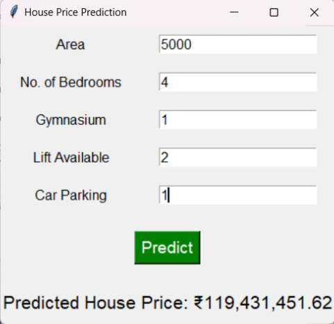

# House Price Prediction

This project uses a Linear Regression model to predict house prices based on selected features. You can input the property's area, number of bedrooms, gymnasium availability, lift availability, and car parking availability to get an estimated house price.

## Getting Started

1. Clone this repository to your local machine.

2. Install the required Python packages by running:

   ```bash
   pip install pandas numpy scikit-learn tkinter
   ```

3. Replace `'house_data.csv'` with your dataset file path.

4. Run the `house_price_prediction.py` script to launch the GUI for predictions.

## How to Use

1. Launch the GUI by running the script.

2. Enter the property details:
   - Area
   - Number of Bedrooms
   - Gymnasium Availability (1 for Yes, 0 for No)
   - Lift Availability (1 for Yes, 0 for No)
   - Car Parking Availability (1 for Yes, 0 for No)

3. Click the "Predict" button to get the estimated house price in rupees (₹).

## Example

Here's a screenshot of the House Price Prediction GUI:



## Contributing

Contributions are welcome! If you have any improvements or suggestions, feel free to create a pull request.

